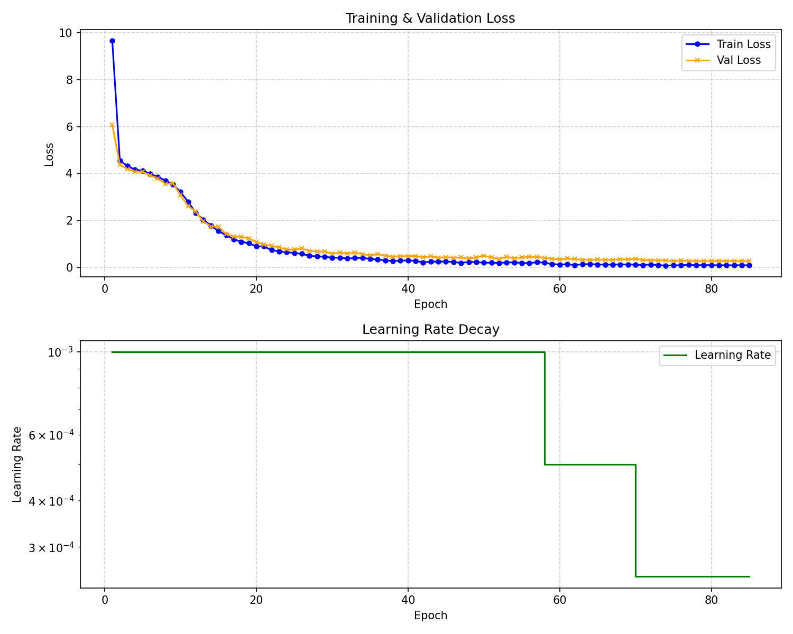
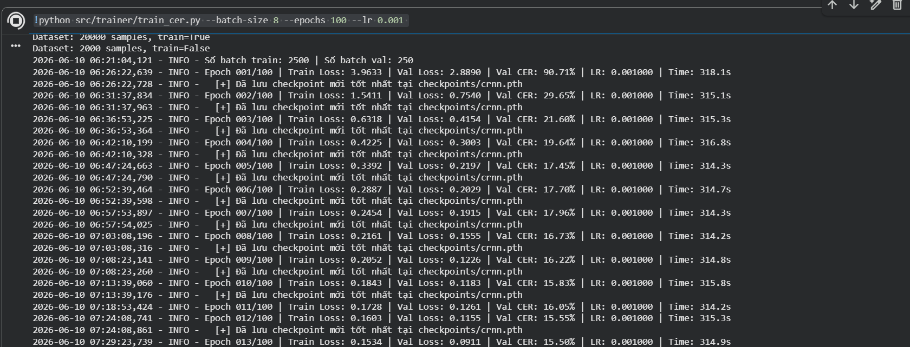
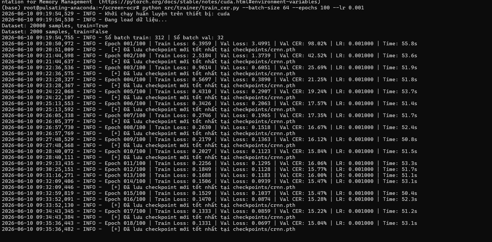
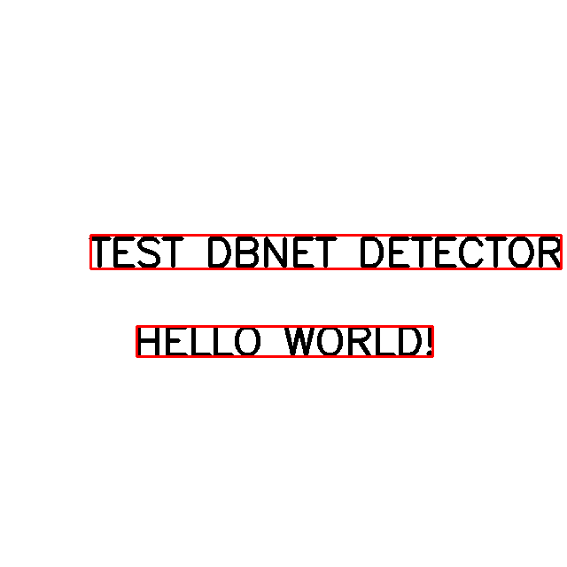
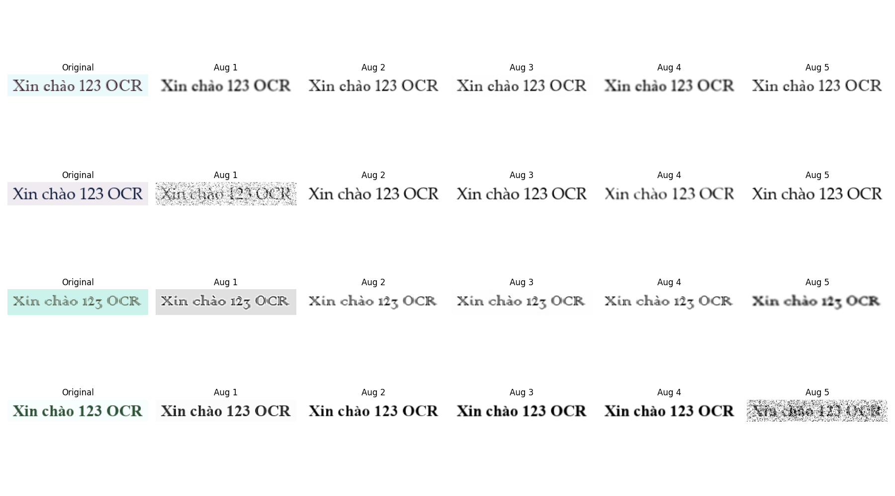

# Screen OCR Engine

Hệ thống OCR tự build cho màn hình Windows — nhận diện text realtime từ screenshot, phục vụ automation, RAG, dịch thuật, game modding.

## Kiến trúc

```
[mss capture] → [DBNet++ detect] → [crop ROIs] → [CRNN recognize] → [post-process] → [text output]
```

| Thành phần | Công nghệ | Ghi chú |
|---|---|---|
| Screen Capture | `mss` | Layer 1 |
| Preprocessing | OpenCV | Layer 2 |
| Text Detection | DBNet++ (ONNX) | Layer 3 — TODO: chưa có model |
| Text Recognition | CRNN custom (ONNX) | Layer 3 — train từ đầu |
| Output | FastAPI + JSON | Layer 4 |

## Cấu trúc thư mục

```
screen-ocr/
├── data/             ← Dataset (gitignored)
├── models/           ← ONNX weights (gitignored)
├── src/              ← Source code chính
├── api/              ← FastAPI service
├── scripts/          ← Utility scripts
├── configs/          ← Config files
├── tests/            ← Unit tests
├── notebooks/        ← Jupyter notebooks (EDA, experiments)
└── reports/          ← Evaluation outputs
```

## Setup

### 1. Tạo conda environment

```bash
conda env create -f environment.yml
conda activate screen-ocr
```

### 2. Tạo charset và liệt kê fonts

```bash
python scripts/list_fonts.py
python -c "from src.charset import save_charset; save_charset()"
```

## Roadmap

| Tuần | Milestone |
|---|---|
| 1 | Data pipeline: synthetic gen + internet data
| 2 | Train CRNN baseline, CER < 20% |
| 4 | Export ONNX, FastAPI, end-to-end < 10000ms |
| 5+ | Tích hợp DBNet++, downstream tasks |

## Quy tắc

Xem [screen-ocr-rules.md](../screen-ocr-rules.md) để biết đầy đủ các nguyên tắc bắt buộc.

- Detection và Recognition là **2 module tách biệt**
- Dùng **ONNX** cho production (không ship `.pt`)

## Kết quả huấn luyện & Đánh giá (CRNN Baseline)

Các báo cáo được tự động xuất ra thư mục `reports/` sau khi huấn luyện.

**1. Quá trình huấn luyện (Training Log)**
- **Epochs:** 86
- **Final Train Loss:** 0.0769
- **Final Val Loss:** 0.2630



**2. Kết quả nhận diện mẫu (Sample Inference)**

Dưới đây là một số hình ảnh kết quả nhận diện sinh ra trong quá trình huấn luyện:







**3. Đánh giá độ chính xác (Evaluation)**

| Dataset | Số mẫu (Samples) | Exact Match (%) | CER Trung bình (%) | Báo cáo chi tiết |
|---|---|---|---|---|
| Synthetic Test (Dữ liệu màn hình giả lập) | 20 | 50.00% | 9.59% | [Xem chi tiết HTML](reports/synthetic_test_evaluation.html) |
| ICDAR 2015 Task 3 (Test thực tế) | 1441 | 47.60% | 23.16% | [Xem chi tiết HTML](reports/test_task3_evaluation.html) |

> [!NOTE]
> Bảng kết quả trên là của bản baseline đào tạo ban đầu (100 epoch). CER trên tập thực tế (ICDAR) vẫn còn khá cao (23%), cần Fine-tune thêm bằng dữ liệu thật (Real data) kết hợp với các kỹ thuật Data Augmentation đa dạng hơn để đạt được chỉ tiêu `< 20% CER` đề ra trong Roadmap. Xem thêm ví dụ Augmentation tại đây: 




**4. Nguồn Text để sinh dữ liệu giả lập (Synthetic Corpus)**

Để huấn luyện nhận diện đa ngôn ngữ, mô hình sử dụng nguồn text lấy từ các tệp corpus lớn (`.txt`), sau đó render chèn lên các background màn hình ngẫu nhiên:
- **Corpus Tiếng Việt (`data/wiki_corpus.txt`)**: Các câu văn phong phú như *"Hệ Trái Đất - Mặt Trăng"*, *"Chiến tranh thế giới thứ hai đã cướp đi..."*, *"Chủ nghĩa Khai sáng và Chủ nghĩa Canh Tân"*, *"Màu của niềm tin và hy vọng"*...
- **Corpus Tiếng Anh (`data/icdar_en_corpus.txt`)**: Văn bản thực tế từ tập ICDAR như *"because she is so full of contradictions"*, *"The status of"*, *"All Things Considered (NPR)"*, *"The loss was the All Blacks' only loss..."*...